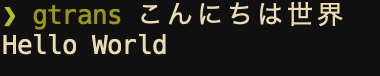

# gtrans
[](https://crates.io/crates/gtrans)


[](https://travis-ci.org/ksk001100/gtrans)

Google translation CLI tool written in Rust

<div align="center">
    
</div>

## install

```bash
$ cargo install gtrans
```

In macOS you can install it with Homebrew
```bash
$ brew tap ksk001100/homebrew-gtrans
$ brew install gtrans
```

## usage

Default translation source is `ja` and target is `en`.

The source and target can be changed by setting the environment variables `GTRANS_SOURCE` and `GTRANS_TARGET`.

The source and target can be changed by specifying the --source and --target flags.  In that case, the flags take precedence over the environment variables.

```bash
$ gtrans こんにちは世界
$ export GTRANS_SOURCE=en
$ export GTRANS_TARGET=ja
$ gtrans Hello world
$ GTRANS_SOURCE=en GTRANS_TARGET=ja gtrans Hello world
$ gtrans Hello world --source en --target ja
```